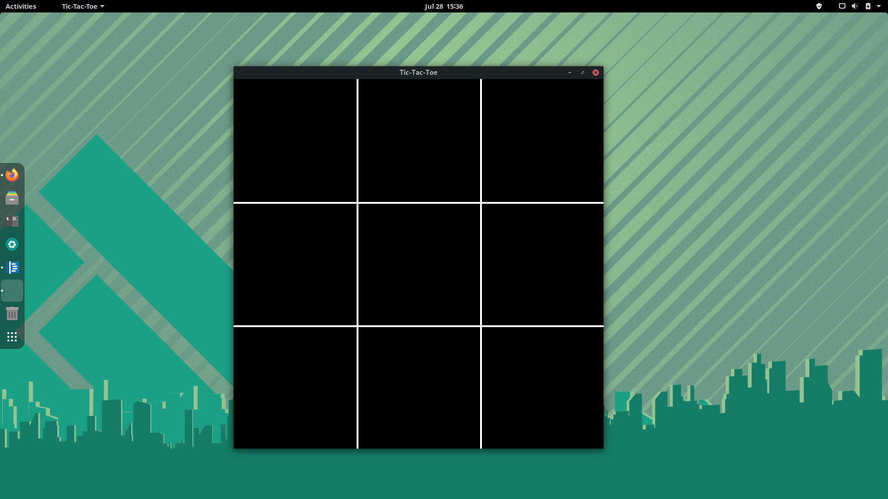
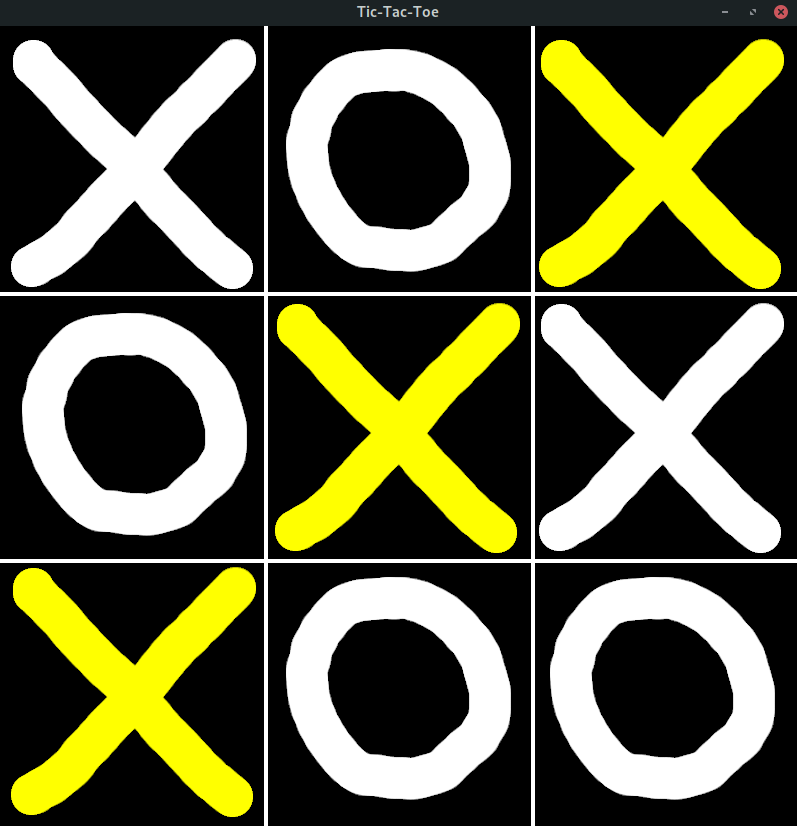
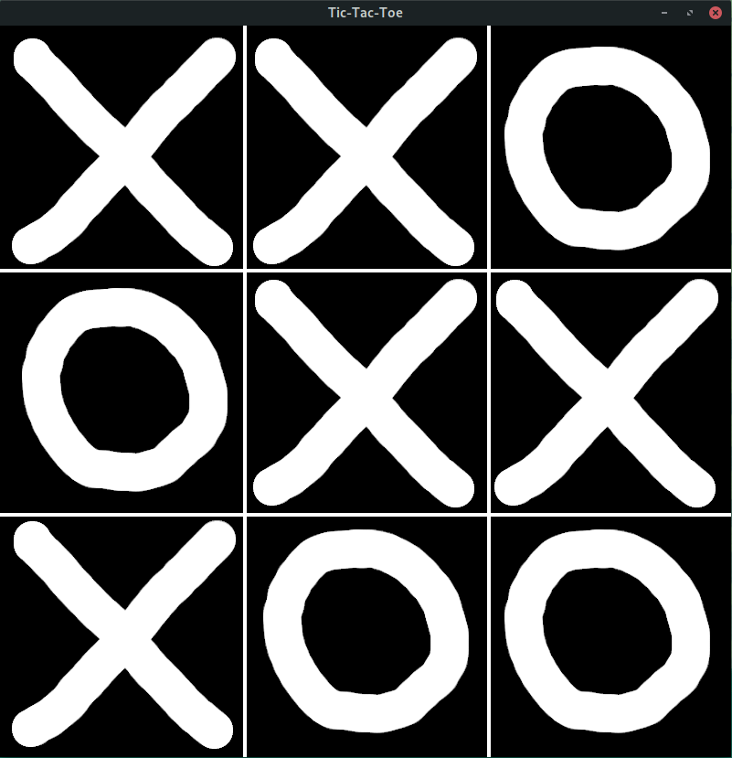
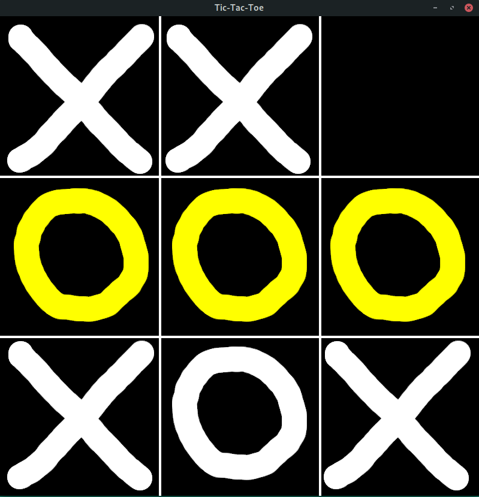

# Simple Tic Tac Toe
## Introduction
I made this simple tic tac toe game to teach myself the basics of SFML, Makefiles, and developing C++ programs with objects and multiple files.

The game is very simple. Two players use the same mouse to select squares. X goes first, and then O. If someone lines up three in a row, their line is highlighted.

### Controls
- Left Click - Puts X or O on game square
- Right Click - Resets the game

## Screenshots

